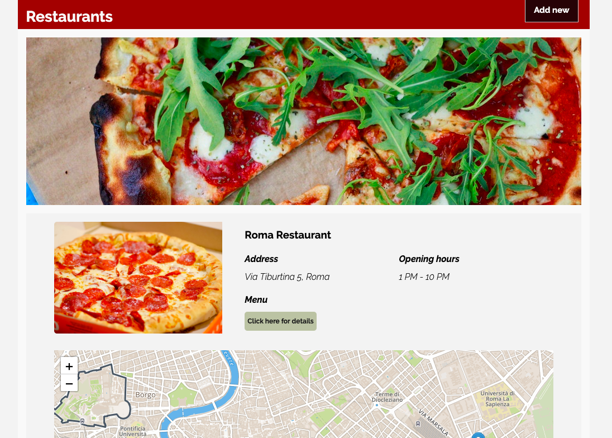

# Pizza Restaurants 🍕

Pizza Restaurants is a simple app to manage restaurants. 

## Table of Contents
- General info
- Technologies
- Prerequisites
- Installation
- Running / Development
- Linting
- Status
- Additional info

### General info
Project is a simple app to manage restaurants. User can see name, address with a map as well as opening hours of the given restaurant. Each restaurant has its own page with details such as menu. User can add new restaurants to the list.

### Technologies
- CSS3
- HTML5
- Ember.js
- ES6
- Mapbox API

### Prerequisites

You will need the following things properly installed on your computer.

* [Git](https://git-scm.com/)
* [Node.js](https://nodejs.org/) (with npm)
* [Ember CLI](https://ember-cli.com/)
* [Google Chrome](https://google.com/chrome/)

### Installation

* `git clone <repository-url>` this repository
* `cd pizza_restaurants`
* `npm install`

### Running / Development

* `LEAFLET_MAPS_API_KEY=<API_KEY_GOES_HERE> ember s` or `ember serve` (If you want to receive Leaflet Maps API key, you need to register at [Mapbox](www.mapbox.com).)
* Visit your app at [http://localhost:4200](http://localhost:4200).

### Linting

* `npm run lint:hbs`
* `npm run lint:js`
* `npm run lint:js -- --fix`

### Status
The basic version of the project is done. 

### Additional info
Photos were downloaded from [Unsplash](https://unsplash.com).